# Architecture Documentation

## Table of Contents

- [Overview](#overview)
- [System Architecture](#system-architecture)
- [Agentic Team Architecture](#agentic-team-architecture)
- [Component Design](#component-design)
- [Data Flow](#data-flow)
- [Adapter Pattern](#adapter-pattern)
- [Workflow Engine](#workflow-engine)
- [Security Architecture](#security-architecture)
- [Monitoring & Observability](#monitoring--observability)
- [Deployment Architecture](#deployment-architecture)
- [Design Patterns](#design-patterns)
- [Graph Context System](#graph-context-system)
- [Agentic Infrastructure](#agentic-infrastructure)
- [Performance Considerations](#performance-considerations)
- [Scalability](#scalability)
- [Optional: MCP Integration Layer](#optional-mcp-integration-layer)

## Overview

The AI Coding Tools Orchestrator is built on a modular, extensible architecture that enables multiple AI agents to collaborate effectively. The system follows enterprise design patterns and best practices for scalability, reliability, and maintainability.

### Core Principles

- **Modularity**: Clear separation of concerns between components
- **Extensibility**: Easy to add new agents and workflows
- **Reliability**: Robust error handling and retry logic
- **Performance**: Async execution and intelligent caching
- **Security**: Input validation, rate limiting, and audit logging
- **Observability**: Comprehensive metrics, structured logging, and automated report generation

## System Architecture

### High-Level Architecture

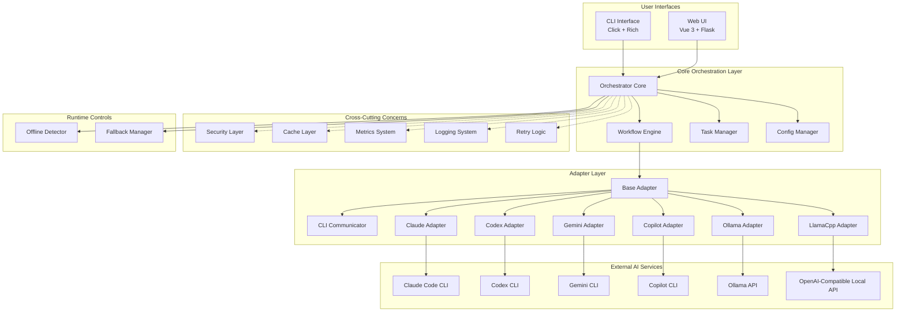

### Component Layers

1. **Interface Layer** - User-facing interfaces (CLI and Web UI)
2. **Orchestration Layer** - Core business logic and workflow management
3. **Cross-Cutting Layer** - Security, caching, metrics, logging
4. **Adapter Layer** - AI agent integrations
5. **Runtime Controls** - Offline detection and fallback routing
6. **External Services** - Third-party AI CLIs and local model APIs

## Agentic Team Architecture

`AGENTIC_TEAM` is a separate runtime path for role-based autonomous team communication. It does not execute through the orchestrator workflow engine.

### Runtime Boundary

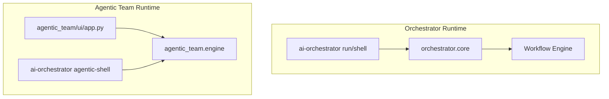

### Core Components

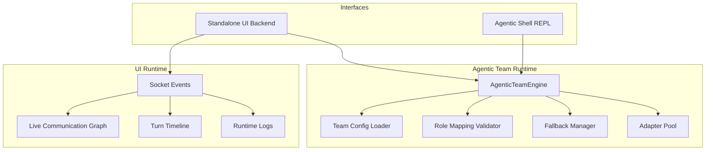

### Turn Loop and Decision Routing

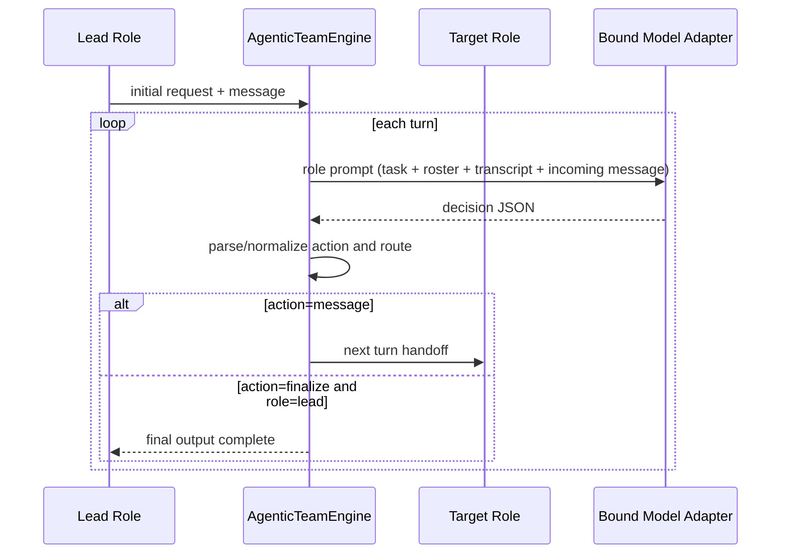

### Communication Event Pipeline

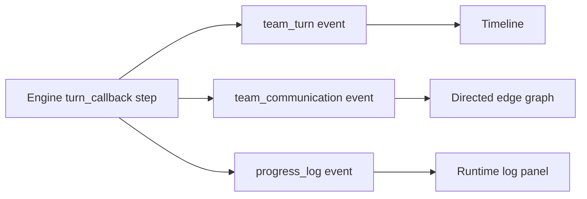

### Graph Aggregation Model

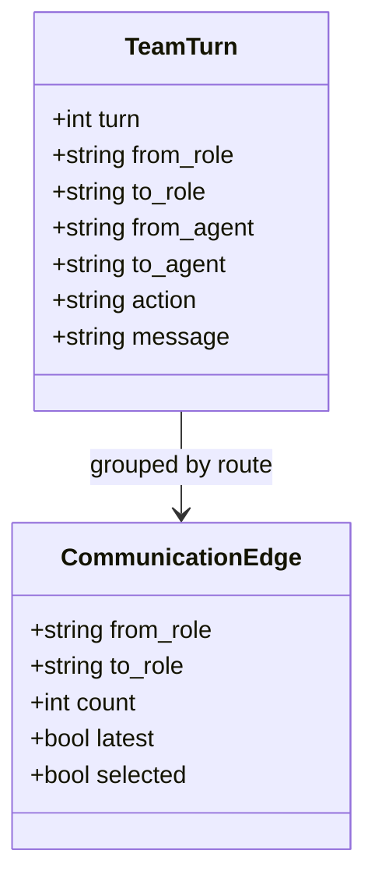

### Validation and Fallback Pipeline

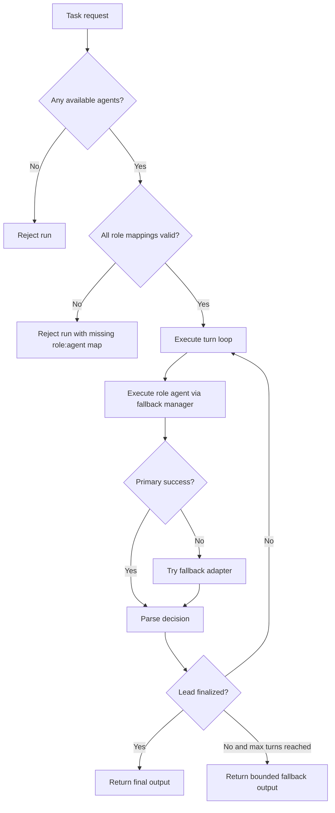

## Component Design

### Orchestrator Core

The central component that coordinates all operations.

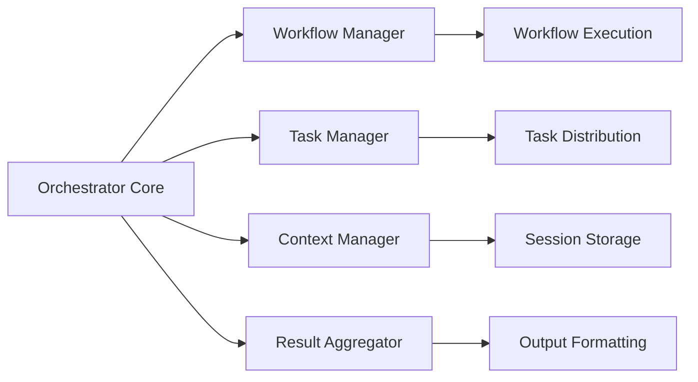

**Responsibilities:**
- Task reception and parsing
- Workflow selection and execution
- Agent coordination
- Result aggregation
- Session management

**Key Files:**
- `orchestrator/core.py` - Main orchestrator logic
- `orchestrator/workflow.py` - Workflow management
- `orchestrator/task_manager.py` - Task distribution

### Workflow Engine

Manages workflow definitions and execution.

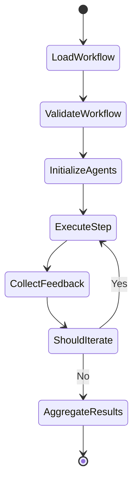

**Workflow Execution Characteristics:**

1. **Sequential Steps** - Agents execute one after another
2. **Iterative Refinement** - Workflow cycles until stop conditions are met
3. **Step-Level Fallback** - If a step fails due to recoverable connectivity/API issues, fallback agent can run
4. **Offline Filtering** - In offline mode, non-local agents are skipped at initialization

**Configuration (Supported Forms):**
```yaml
agents:
  codex:
    type: cli
    command: codex
    enabled: true

  my-custom-llama:
    type: llamacpp
    endpoint: http://localhost:9000
    offline: true
    enabled: true

workflows:
  default:
    - agent: "codex"
      task: "implement"
    - agent: "gemini"
      task: "review"
    - agent: "claude"
      task: "refine"

  offline-default:
    description: "Local-only workflow"
    steps:
      - agent: "local-code"
        role: "implementer"
      - agent: "local-instruct"
        role: "reviewer"
```

### Adapter Layer

Abstracts AI agent interactions through a common interface.

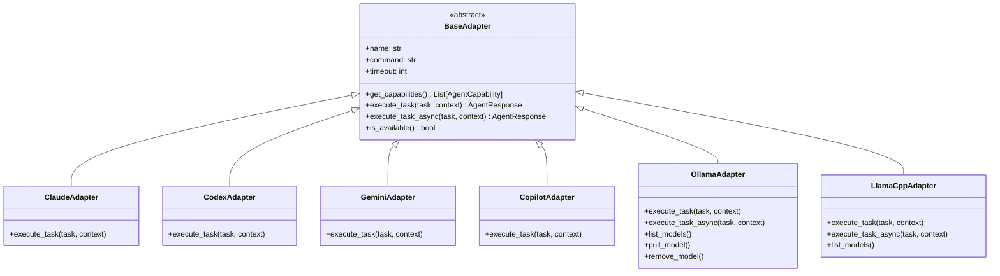

**Base Adapter Interface:**
```python
class BaseAdapter(ABC):
    @abstractmethod
    def get_capabilities(self) -> List[AgentCapability]:
        """Declare supported capability set."""
        pass

    @abstractmethod
    def execute_task(self, task: str, context: Dict[str, Any]) -> AgentResponse:
        """Execute task with the AI agent."""
        pass

    async def execute_task_async(self, task: str, context: Dict[str, Any]) -> AgentResponse:
        """Async execution hook (default delegates to sync)."""
        ...
```

### CLI Communicator

Handles robust communication with external CLI tools.

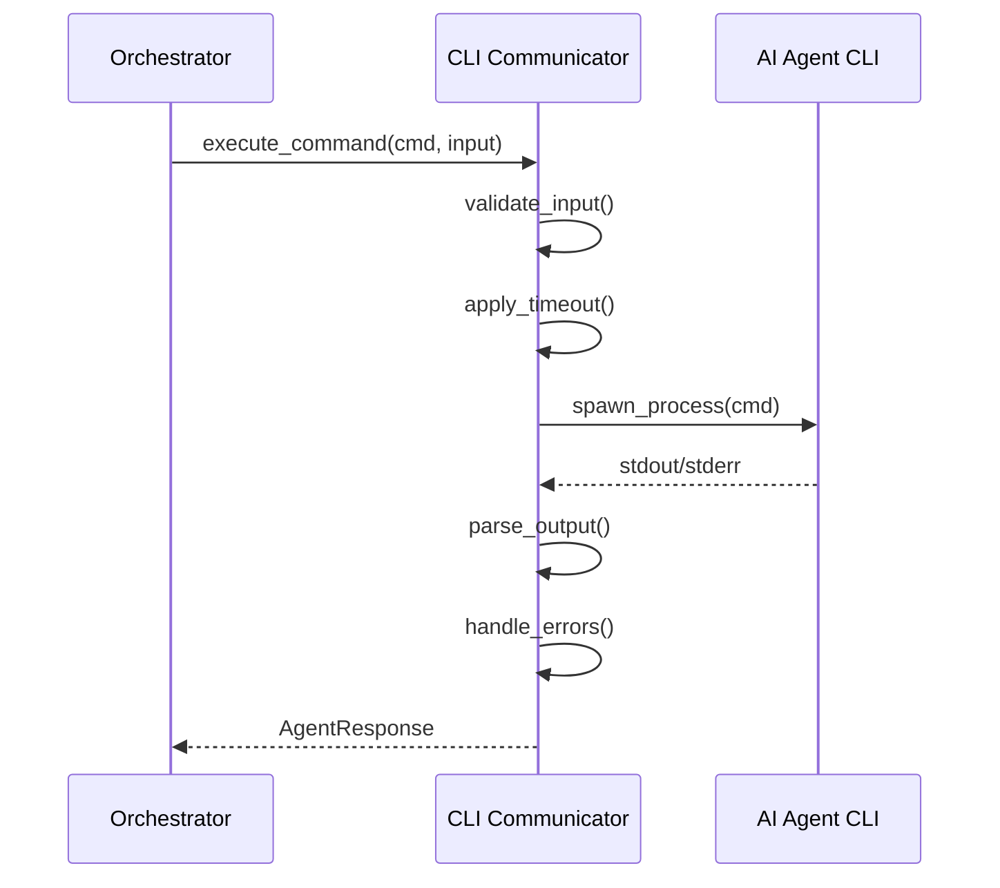

**Features:**
- Process management
- Timeout handling
- Error recovery
- Output parsing
- Retry logic

## Data Flow

### Task Execution Flow

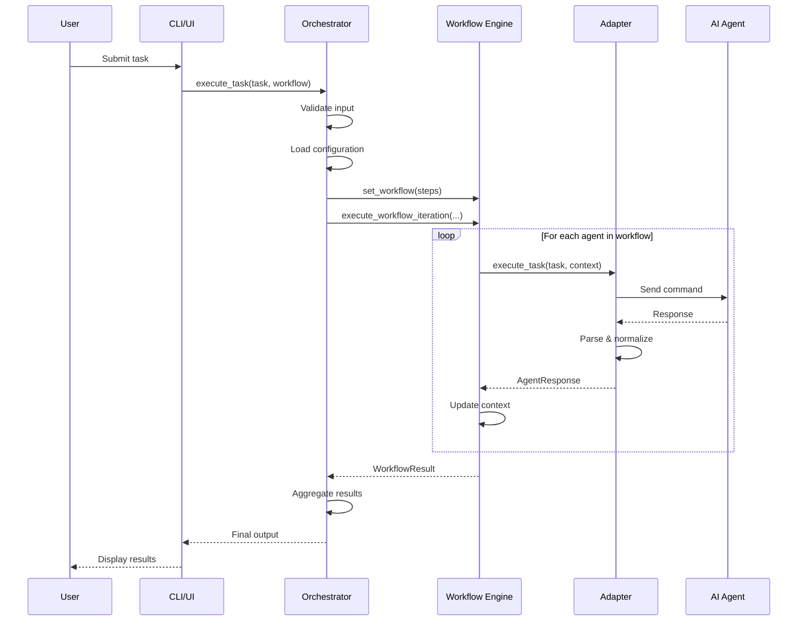

### Conversation Mode Flow

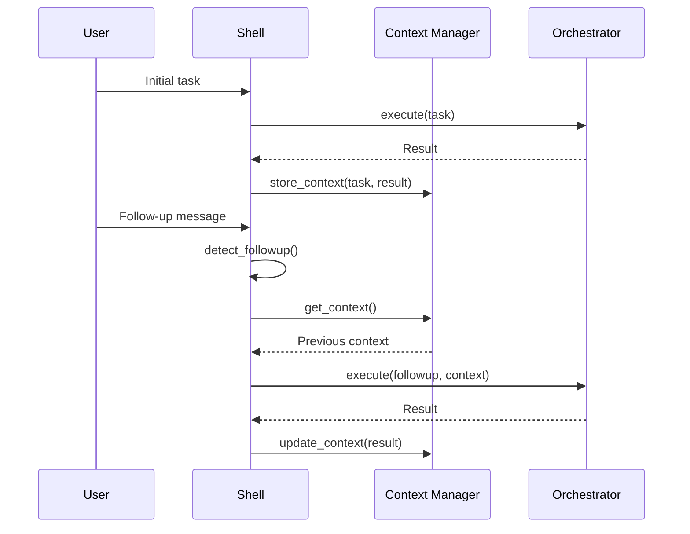

### File Generation Flow

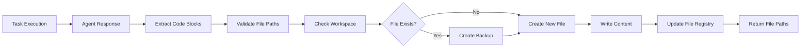

## Adapter Pattern

### Why Adapters?

Adapters provide a consistent interface to heterogeneous AI agent CLIs:

- **Abstraction**: Hide CLI-specific details
- **Consistency**: Uniform interface for all agents
- **Flexibility**: Easy to swap or add agents
- **Testability**: Mock adapters for testing
- **Resilience**: Isolated error handling

### Adapter Implementation

```python
class OllamaAdapter(BaseAdapter):
    def __init__(self, config: Dict[str, Any]):
        local_config = dict(config)
        local_config.setdefault("offline", True)
        super().__init__(local_config)
        self.model = local_config.get("model", "codellama:13b")
        self.endpoint = str(local_config.get("endpoint", "http://localhost:11434")).rstrip("/")
        self.timeout = int(local_config.get("timeout", 300))

    async def execute_task_async(self, task: str, context: Dict[str, Any]) -> AgentResponse:
        prompt = self._build_local_llm_prompt(task, context)
        async with httpx.AsyncClient(timeout=self.timeout) as client:
            resp = await client.post(
                f"{self.endpoint}/api/generate",
                json={"model": self.model, "prompt": prompt, "stream": False},
            )
            resp.raise_for_status()
            data = resp.json()
            return AgentResponse(success=True, output=data.get("response", ""))
```

## Workflow Engine

### Workflow Execution

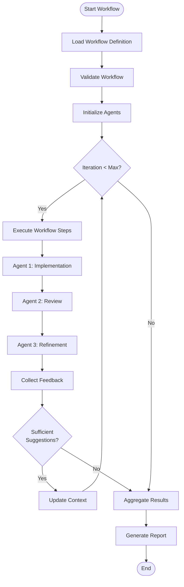

### Workflow Configuration

Workflows are defined in YAML:

```yaml
workflows:
  thorough:
    - agent: "codex"
      task: "implement"
      description: "Create initial implementation"
    - agent: "copilot"
      task: "suggestions"
      description: "Get alternative approaches"
    - agent: "gemini"
      task: "review"
      description: "Comprehensive code review"
    - agent: "claude"
      task: "refine"
      description: "Implement feedback"
    - agent: "gemini"
      task: "review"
      description: "Verify improvements"

  hybrid:
    description: "Local draft with cloud review + fallback"
    steps:
      - agent: "local-code"
        role: "implementer"
      - agent: "claude"
        role: "reviewer"
        fallback: "local-instruct"

settings:
  max_iterations: 5
  fallback:
    enabled: true
    map:
      claude: local-instruct
  offline:
    enabled: false
    auto_detect: true
```

### Offline and Fallback Runtime

`Orchestrator` resolves runtime mode and adapter availability before execution:

1. Determine offline mode from `--offline`, `settings.offline.enabled`, and cached connectivity auto-detection.
2. Initialize adapters dynamically from `agents.<name>.type`.
3. In offline mode, skip non-local agents.
4. For each step, try primary adapter.
5. On recoverable connection/API failure, execute mapped or step-level fallback adapter.

## Security Architecture

### Security Layers

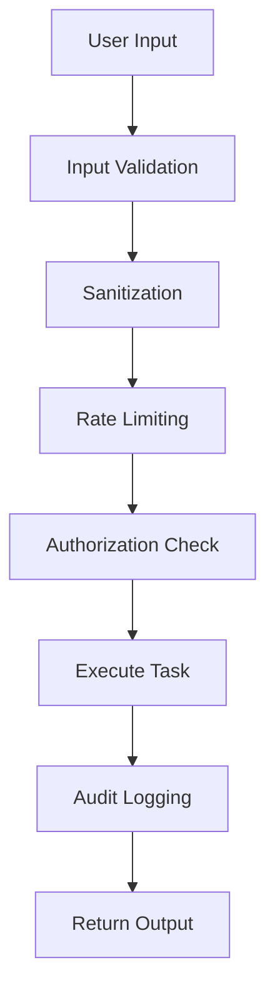

### Security Components

1. **Input Validation**
   - Command injection prevention
   - Path traversal protection
   - Malicious payload detection

2. **Rate Limiting**
   - Token bucket algorithm
   - Per-user limits
   - Global rate limits

3. **Secret Management**
   - Environment variables
   - Secure key storage
   - No hardcoded credentials

4. **Audit Logging**
   - All security events logged
   - Tamper-proof logs
   - Retention policies

**Implementation:**
```python
class SecurityManager:
    def validate_input(self, user_input: str) -> bool:
        # Check for command injection
        if self._contains_shell_metacharacters(user_input):
            raise SecurityError("Potential command injection")

        # Check for path traversal
        if self._contains_path_traversal(user_input):
            raise SecurityError("Path traversal detected")

        return True

    def rate_limit_check(self, user_id: str) -> bool:
        if not self.rate_limiter.allow_request(user_id):
            raise RateLimitError("Rate limit exceeded")
        return True
```

## Monitoring & Observability

### Metrics Architecture

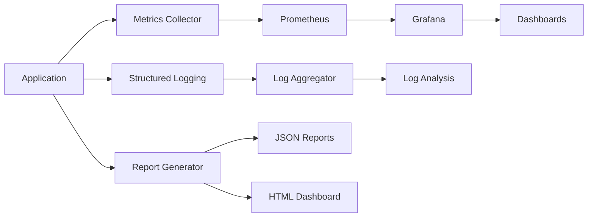

### Report Generation

The `ReportGenerator` (`orchestrator/observability/report_generator.py`) automatically produces reports after each task execution when `create_reports: true` is set in config. Reports are written as JSON files plus an interactive HTML dashboard.

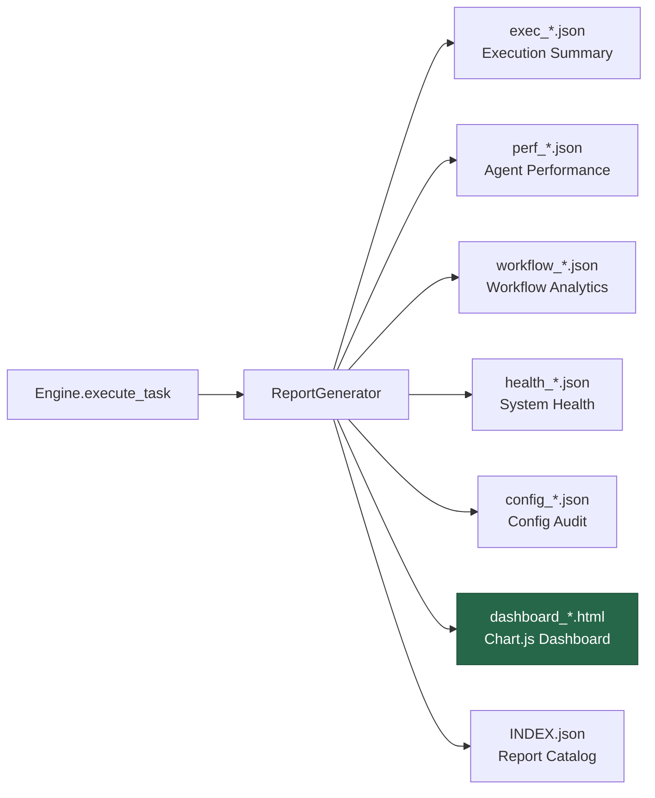

**Report types:**
- **Execution Summary** — Per-task results with steps, agents, fallbacks, suggestions, and duration
- **Agent Performance** — Aggregated success rates, call counts, and task type distribution
- **Workflow Analytics** — Per-workflow run counts, success rates, and average iterations
- **System Health** — Health check results with disk, memory, Python version, and platform info
- **Config Audit** — Agent availability, workflow structure, and settings snapshot
- **HTML Dashboard** — Interactive Chart.js dashboard with KPI cards, daily volume bar chart, agent success/failure stacked bar, duration trend line, and workflow distribution doughnut

### Key Metrics

**Task Metrics:**
- `orchestrator_tasks_total` - Counter
- `orchestrator_task_duration_seconds` - Histogram
- `orchestrator_task_failures_total` - Counter

**Agent Metrics:**
- `orchestrator_agent_calls_total` - Counter
- `orchestrator_agent_errors_total` - Counter
- `orchestrator_agent_response_time_seconds` - Histogram

**System Metrics:**
- `orchestrator_cache_hits_total` - Counter
- `orchestrator_cache_misses_total` - Counter
- `orchestrator_active_sessions` - Gauge

### Structured Logging

```python
import structlog

logger = structlog.get_logger()

logger.info(
    "task_executed",
    task_id="task-123",
    workflow="default",
    duration_ms=1234.56,
    agent="codex",
    success=True
)
```

## Deployment Architecture

### Container Architecture

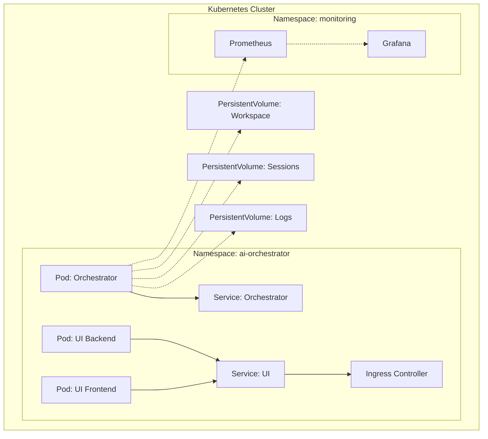

### Docker Compose Setup

```yaml
version: '3.8'

services:
  orchestrator:
    build: .
    volumes:
      - ./workspace:/app/workspace
      - ./sessions:/app/sessions
    ports:
      - "9090:9090"  # Metrics
    environment:
      - LOG_LEVEL=INFO
      - ENABLE_METRICS=true

  prometheus:
    image: prom/prometheus
    volumes:
      - ./monitoring/prometheus.yml:/etc/prometheus/prometheus.yml
    ports:
      - "9091:9090"

  grafana:
    image: grafana/grafana
    ports:
      - "3000:3000"
    environment:
      - GF_SECURITY_ADMIN_PASSWORD=admin
```

## Design Patterns

### Patterns Used

#### 1. Adapter Pattern
Provides a uniform interface to different AI agent CLIs.

#### 2. Strategy Pattern
Workflows implement different strategies for task execution.

#### 3. Chain of Responsibility
Request processing through validation, execution, and post-processing.

#### 4. Observer Pattern
Real-time updates in Web UI via Socket.IO.

#### 5. Factory Pattern
Agent and workflow creation.

#### 6. Singleton Pattern
Configuration manager, metrics collector.

#### 7. Decorator Pattern
Retry logic, caching, logging decorators.

### Example: Retry Decorator

```python
from functools import wraps
from tenacity import retry, stop_after_attempt, wait_exponential

def with_retry(max_attempts=3):
    def decorator(func):
        @wraps(func)
        @retry(
            stop=stop_after_attempt(max_attempts),
            wait=wait_exponential(multiplier=1, min=2, max=10)
        )
        def wrapper(*args, **kwargs):
            return func(*args, **kwargs)
        return wrapper
    return decorator

@with_retry(max_attempts=3)
def execute_agent_task(agent, task):
    return agent.execute_task(task, {"role": "implement"})
```

## Graph Context System

The Graph Context System provides persistent memory capabilities for AI agents, enabling learning from past conversations, tasks, and mistakes.

### Architecture

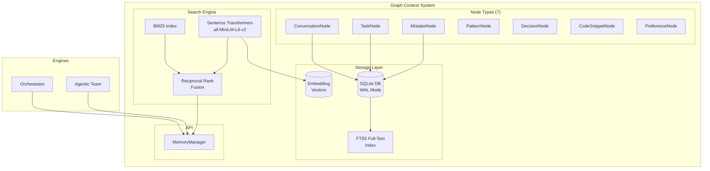

### Hybrid Search

The system combines keyword-based BM25 search with semantic embedding search using Reciprocal Rank Fusion:

```mermaid
sequenceDiagram
    participant Q as Query
    participant H as HybridSearch
    participant B as BM25
    participant E as Embeddings
    participant R as RRF Fusion

    Q->>H: search("authentication patterns")

    par Parallel Search
        H->>B: Keyword search
        B-->>H: keyword_results
    and
        H->>E: Generate embedding
        E-->>H: Semantic results
    end

    H->>R: Combine results
    R-->>H: Fused ranking
    H-->>Q: Top-k results
```

### Edge Types

12 semantic edge types for building a knowledge graph:

| Edge Type | Purpose | Example |
|-----------|---------|---------|
| RELATED_TO | General relationship | Task ↔ Conversation |
| CAUSED_BY | Error causation | Mistake → Root Cause |
| FIXED_BY | Solution mapping | Mistake → Fix |
| SIMILAR_TO | Semantic similarity | Task ↔ Similar Task |
| DEPENDS_ON | Dependencies | Task → Prerequisite |
| LEARNED_FROM | Learning source | Pattern → Source |

### Integration

Both engines automatically store task results:

```python
# Automatic storage in execute_task()
result = engine.execute_task("Build login system")
# → Task automatically stored with outcome, duration, metadata

# Retrieve relevant context
context = engine.get_relevant_context("authentication patterns")
# → Returns formatted context from past tasks/mistakes
```

## Agentic Infrastructure

The platform provides comprehensive infrastructure to empower AI agents:

### Specialized Agents

```mermaid
mindmap
  root((Specialized<br/>Agents))
    Web Development
      web-frontend
    Backend
      backend-api
      database-architect
    Security
      security-specialist
    Infrastructure
      devops-infrastructure
      performance-engineer
    AI/ML
      ai-ml-engineer
    Mobile
      mobile-developer
    Documentation
      documentation-writer
```

9 specialized agents with domain expertise:

| Agent | Expertise |
|-------|-----------|
| web-frontend | React, Vue, Angular, CSS, Accessibility |
| backend-api | REST, GraphQL, Microservices |
| security-specialist | OWASP, Secure Coding, Audits |
| devops-infrastructure | Docker, K8s, CI/CD, Cloud |
| ai-ml-engineer | ML Pipelines, LLMs, RAG |
| database-architect | Schema, Optimization, Migrations |
| mobile-developer | React Native, Flutter, Native |
| performance-engineer | Profiling, Caching, Load Testing |
| documentation-writer | API Docs, Architecture, READMEs |

### Skills Library

22 reusable skills across 6 categories:

```mermaid
graph LR
    subgraph Skills["Skills Library (22)"]
        DEV[Development<br/>6 skills]
        TEST[Testing<br/>4 skills]
        SEC[Security<br/>4 skills]
        OPS[DevOps<br/>3 skills]
        ML[AI/ML<br/>3 skills]
        DOC[Documentation<br/>3 skills]
    end
```

### MCP Tools

34+ tools exposed via Model Context Protocol:

| Category | Tools | Purpose |
|----------|-------|---------|
| Code Analysis | 4 | Complexity, patterns, dependencies |
| Security | 4 | Secrets, injection, headers, audit |
| Testing | 4 | Test cases, stubs, coverage |
| DevOps | 5 | Docker, compose, CI, deploy |
| Context | 7 | Store, search, retrieve, learn |

📚 **See [AGENTIC_INFRA.md](AGENTIC_INFRA.md) for complete documentation.**

## Performance Considerations

### Caching Strategy

```mermaid
graph LR
    A[Request] --> B{Cache Hit?}
    B -->|Yes| C[Return Cached]
    B -->|No| D[Execute Task]
    D --> E[Store in Cache]
    E --> F[Return Result]
```

**Cache Types:**
- **In-memory**: Fast, volatile (TTL: 5 minutes)
- **File-based**: Persistent, slower (TTL: 24 hours)
- **Distributed**: Redis/Memcached (optional)

### Async Execution

```python
import asyncio

async def execute_workflow_async(tasks: List[Task]):
    # Adapter-level async execution for HTTP-backed local agents
    results = await asyncio.gather(
        *[agent.execute_task_async(task.description, task.context) for task in tasks],
        return_exceptions=True
    )
    return results
```

## Scalability

### Horizontal Scaling

- **Stateless Design**: Sessions stored externally
- **Load Balancing**: Multiple orchestrator instances
- **Database**: Shared configuration and state
- **Message Queue**: Task distribution (future enhancement)

### Vertical Scaling

- **Connection Pooling**: Reuse connections to AI services
- **Worker Threads**: Parallel task processing
- **Memory Management**: Efficient caching strategies
- **Resource Limits**: CPU and memory constraints

## Optional: MCP Integration Layer

Both systems can optionally be exposed to external MCP-compatible clients via a FastMCP 3.x server (`mcp_server/`). This is a **separate, optional component** — neither system depends on it.

```mermaid
graph TD
    subgraph "MCP Clients (optional)"
        CD[Claude Desktop]
        CC[Claude Code]
        LA[LLM Agent]
    end

    subgraph "MCP Server (mcp_server/)"
        S[FastMCP 3.x]
        S --> OT[Orchestrator Tools ×4]
        S --> ATT[Agentic Team Tools ×5]
        S --> ST[Shared Tools ×1]
    end

    subgraph "Core Systems (independent)"
        ORCH[Orchestrator]
        ATE[Agentic Team]
    end

    CD & CC & LA -->|MCP Protocol| S
    OT --> ORCH
    ATT --> ATE
```

See [`MCP.md`](MCP.md) for the complete MCP documentation.

---

For more information:
- [Features Documentation](FEATURES.md)
- [Agentic Team Documentation](AGENTIC_TEAM.md)
- [Orchestrator Documentation](ORCHESTRATOR.md)
- [MCP Server Documentation](MCP.md)
- [Setup Guide](SETUP.md)
- [Adding Agents Guide](ADD_AGENTS.md)

> **Easter egg:** Go to our [wiki page](https://hoangsonww.github.io/AI-Agents-Orchestrator/) and enter Konami code (↑ ↑ ↓ ↓ ← → ← → B A) for a surprise!
