# AI Coding Tools Orchestrator and Agentic Team Runtime


<div align="center">

**Two self-contained systems -- an AI Orchestrator and an Agentic Team runtime -- that coordinate cloud and local AI coding assistants (Claude, Codex, Gemini, Copilot, Ollama, llama.cpp) to collaborate on software development tasks.**

[Overview](#overview) | [Architecture](#architecture) | [System Comparison](#system-comparison) | [Features](#feature-highlights) | [Quick Start](#quick-start) | [Project Structure](#project-structure) | [Configuration](#configuration) | [Deployment](#deployment) | [Testing](#testing) | [MCP Server](#mcp-server-optional----model-context-protocol)

</div>

---

## Overview

AI Coding Tools ships two completely independent systems in a single repository. The **Orchestrator** runs step-based workflows where AI agents execute tasks in sequence (implement, review, refine). The **Agentic Team** runs a free-communication runtime where role-based agents (Project Manager, Architect, Developer, QA, DevOps) discuss a task in turns until the team lead declares the work complete. Each system carries its own adapters, configuration, UI, and CLI -- they share zero code and zero imports.

## Architecture

### High-Level Overview

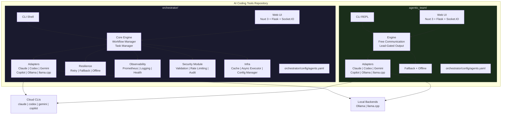

### Orchestrator Workflow Execution

The Orchestrator processes tasks through a configurable pipeline of AI agents. Each step in a workflow maps to a specific agent and role.

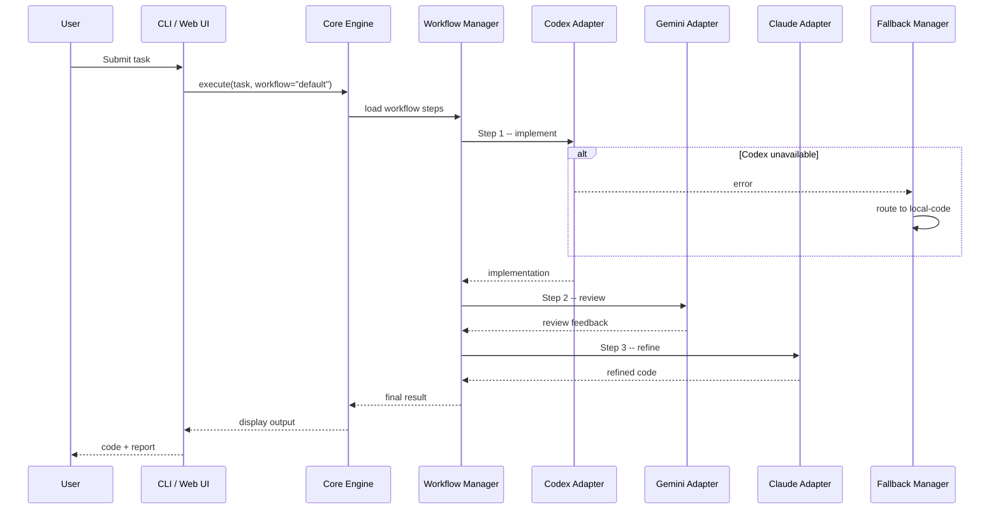

### Agentic Team Communication Flow

The Agentic Team uses free role-to-role communication. Agents speak in turns, address each other by role, and the team lead decides when the task is complete.

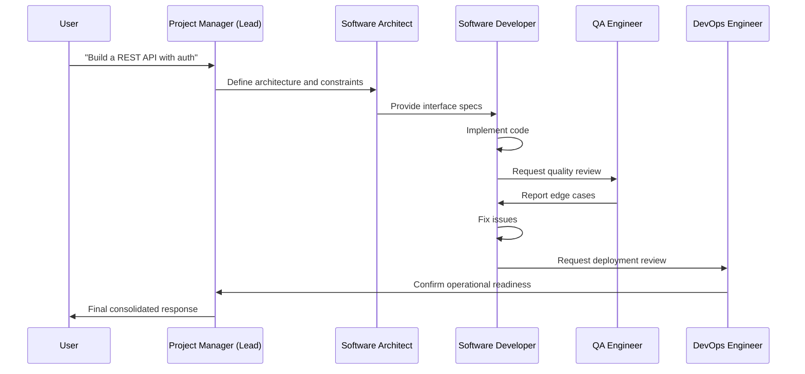

### Adapter Resolution Flow

Both systems resolve which AI backend to use at runtime. The adapter layer abstracts cloud CLIs and local model servers behind a common interface.

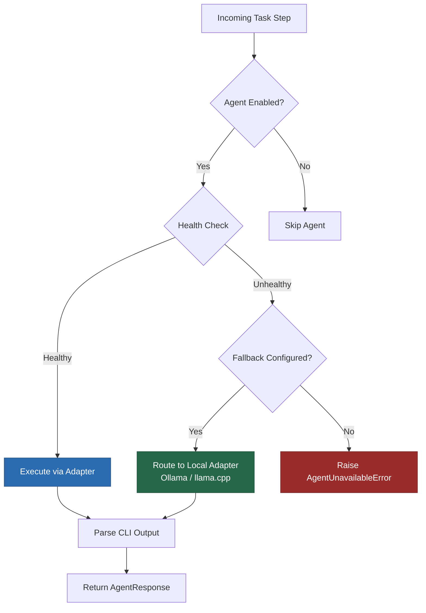

### Technology Stack Overview

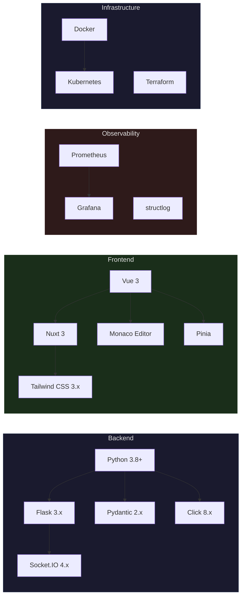

## System Comparison

The two systems serve different collaboration models. Choose based on your use case.

| Dimension | Orchestrator (`orchestrator/`) | Agentic Team (`agentic_team/`) |
|---|---|---|
| **Collaboration model** | Step-based pipeline (sequential) | Free role-to-role communication (turns) |
| **Agent identity** | Tool names (codex, gemini, claude) | Roles (PM, Architect, Developer, QA, DevOps) |
| **Control flow** | Workflow YAML defines fixed step order | Team lead (PM) gates completion dynamically |
| **When to use** | Repeatable pipelines: implement, review, refine | Open-ended tasks needing discussion and consensus |
| **CLI entry point** | `ai-orchestrator shell` | `ai-orchestrator agentic-shell` |
| **Web UI port** | `:5001` | `:5002` |
| **Config file** | `orchestrator/config/agents.yaml` | `agentic_team/config/agents.yaml` |
| **Built-in workflows** | 7 (default, quick, thorough, review-only, document, offline-default, hybrid) | N/A (turn-based, no fixed pipeline) |
| **Fallback strategy** | Per-step cloud-to-local routing | Independent fallback manager |
| **Observability** | Prometheus metrics, structured logging, health probes | Health and readiness probes |
| **Security module** | Input validation, rate limiting, audit logging | N/A (inherits from adapter layer) |
| **Shared code** | None | None |

## Feature Highlights

### Orchestrator (`orchestrator/`)

| Category | Features |
|---|---|
| **Workflows** | 7 built-in workflows (default, quick, thorough, review-only, document, offline-default, hybrid); define custom ones in YAML |
| **Agents** | Claude, Codex, Gemini, Copilot (cloud); Ollama, llama.cpp (local) |
| **CLI** | Interactive REPL shell, one-shot commands, context-aware follow-ups, readline support |
| **Web UI** | Nuxt 3 + Vue 3 frontend, Flask + Socket.IO backend, Monaco code editor, Pinia state management |
| **Resilience** | Retry with exponential backoff, circuit breakers, cloud-to-local fallback, offline detection |
| **Observability** | Prometheus metrics, structured logging via structlog, health and readiness probes |
| **Security** | Input validation, rate limiting, secret management, audit logging |
| **Infra** | Async executor, response caching, connection pooling, config manager |

### Agentic Team (`agentic_team/`)

| Category | Features |
|---|---|
| **Runtime** | Free role-to-role communication, configurable turn limits, lead-gated final responses |
| **Roles** | Project Manager, Software Architect, Software Developer, QA Engineer, DevOps Engineer |
| **CLI** | Dedicated REPL (`agentic-shell`) with `--max-turns` and `--offline` flags |
| **Web UI** | Dedicated Nuxt 3 + Flask UI with Config Studio, real-time turn streaming, team communication view |
| **Fallback** | Independent fallback manager and offline detector |
| **Configuration** | Separate `agents.yaml` with `agentic_team.roles` section for role-to-agent mapping |

## Quick Start

### Prerequisites

- **Operating System**: Linux, macOS, or Windows (WSL recommended)
- **Python**: 3.8 or higher
- **Node.js**: 20+ (for Web UI)
- **Memory**: Minimum 4GB RAM
- **Disk Space**: 1GB for installation + workspace
- **Network**: Required for AI CLI tools and updates
- **Claude Code**: Installed, setup, and signed in on your machine (Required for any workflows using Claude Code - if you run `claude` in terminal and it works, you're good)
- **OpenAI Codex**: Installed and authenticated (if using Codex agent, try running `codex` and see if it responds)
- **Google Gemini CLI**: Installed and authenticated (if using Gemini agent, try `gemini --version` to verify)
- **GitHub Copilot CLI**: Installed and authenticated (if using Copilot agent, try `copilot --version` to verify)
- **Llama.cpp or Ollama**: If using local LLM agents, ensure they are installed and configured properly (try running `ollama list` or `llamacpp --help` to verify)
- **Optional**: Docker and Docker Compose for containerized setup

### Install

```bash
git clone https://github.com/hoangsonww/AI-Agents-Orchestrator.git
cd AI-Agents-Orchestrator

python3 -m venv venv
source venv/bin/activate   # Windows: venv\Scripts\activate

pip install -r requirements.txt
chmod +x ai-orchestrator
```

### Run the Orchestrator

```bash
# Interactive shell
./ai-orchestrator shell

# One-shot task
./ai-orchestrator run "Create a Python REST API" --workflow default

# Start the Web UI
make run-ui
# Then open http://localhost:5001
```

### Run the Agentic Team

```bash
# Interactive REPL
./ai-orchestrator agentic-shell

# With options
./ai-orchestrator agentic-shell --max-turns 16 --offline

# Start the Web UI
make run-agentic-ui
# Then open http://localhost:5002
```

### Verify Installation

```bash
./ai-orchestrator --help        # Show all commands
./ai-orchestrator agents        # List available agents
./ai-orchestrator workflows     # List available workflows
./ai-orchestrator validate      # Validate configuration
```

## Project Structure

```
AI-Coding-Tools/
|
|-- mcp_server/                      # MCP server (FastMCP 3.x)
|   |-- server.py                    # 10 tools + 2 resources
|
|-- orchestrator/                    # Self-contained orchestrator system
|   |-- __init__.py
|   |-- adapters/                    # AI agent adapters
|   |   |-- base.py                  #   Abstract base adapter
|   |   |-- claude_adapter.py        #   Claude Code CLI
|   |   |-- codex_adapter.py         #   OpenAI Codex CLI
|   |   |-- gemini_adapter.py        #   Google Gemini CLI
|   |   |-- copilot_adapter.py       #   GitHub Copilot CLI
|   |   |-- ollama_adapter.py        #   Ollama local models
|   |   |-- llama_cpp_adapter.py     #   llama.cpp / OpenAI-compatible
|   |   +-- cli_communicator.py      #   Robust CLI subprocess handling
|   |-- core/                        # Core orchestration logic
|   |   |-- engine.py                #   Main orchestration engine
|   |   |-- workflow.py              #   Workflow definitions and runner
|   |   |-- task_manager.py          #   Task lifecycle management
|   |   +-- exceptions.py            #   Custom exception hierarchy
|   |-- resilience/                  # Fault tolerance
|   |   |-- retry.py                 #   Retry with exponential backoff
|   |   |-- fallback.py              #   Cloud-to-local fallback routing
|   |   +-- offline.py               #   Offline detection
|   |-- observability/               # Monitoring and logging
|   |   |-- metrics.py               #   Prometheus metrics
|   |   |-- logging_config.py        #   Structured logging setup
|   |   +-- health.py                #   Health and readiness probes
|   |-- security_module/             # Security layer
|   |   +-- security.py              #   Validation, rate limiting, audit
|   |-- infra/                       # Infrastructure utilities
|   |   |-- cache.py                 #   Response caching
|   |   |-- async_executor.py        #   Async task execution
|   |   +-- config_manager.py        #   Configuration loading
|   |-- cli/                         # CLI interface
|   |   +-- shell.py                 #   Interactive REPL shell
|   |-- config/
|   |   +-- agents.yaml              #   Agents, workflows, settings
|   |-- ui/                          # Web UI
|   |   |-- app.py                   #   Flask + Socket.IO backend
|   |   |-- frontend/                #   Nuxt 3 + Vue 3 + Tailwind
|   |   |-- static/
|   |   +-- templates/
|   +-- README.md                    #   Orchestrator-specific docs
|
|-- agentic_team/                    # Self-contained agentic team system
|   |-- __init__.py
|   |-- engine.py                    # Role-based communication engine
|   |-- shell.py                     # Agentic team REPL
|   |-- decision_parser.py           # Turn decision parsing
|   |-- config_utils.py              # Config loading utilities
|   |-- constants.py                 # Shared constants
|   |-- fallback.py                  # Independent fallback manager
|   |-- offline.py                   # Independent offline detector
|   |-- adapters/                    # Own copy of AI agent adapters
|   |   |-- base.py
|   |   |-- claude_adapter.py
|   |   |-- codex_adapter.py
|   |   |-- gemini_adapter.py
|   |   |-- copilot_adapter.py
|   |   |-- ollama_adapter.py
|   |   |-- llama_cpp_adapter.py
|   |   +-- cli_communicator.py
|   |-- config/
|   |   +-- agents.yaml              #   Agents, roles, team settings
|   |-- ui/                          # Dedicated Web UI
|   |   |-- app.py                   #   Flask + Socket.IO backend
|   |   |-- frontend/                #   Nuxt 3 + Vue 3 + Tailwind
|   |   |-- static/
|   |   +-- templates/
|   +-- README.md                    #   Agentic team-specific docs
|
|-- tests/                           # Unified test suite
|   |-- conftest.py
|   |-- test_orchestrator.py
|   |-- test_adapters.py
|   |-- test_adapter_execution.py
|   |-- test_agentic_team_engine.py
|   |-- test_agentic_ui_backend.py
|   |-- test_integration.py
|   |-- test_functional_e2e.py
|   |-- test_enterprise_hardening.py
|   |-- test_production_hardening.py
|   +-- ...
|
|-- deployment/                      # Deployment configurations
|   |-- kubernetes/
|   |-- azure/
|   |-- systemd/
|   |-- load-balancer/
|   +-- scripts/
|
|-- docs/                            # Documentation
|   |-- images/                      #   Screenshots
|   |-- orchestrator-architecture.md
|   |-- orchestrator-api-reference.md
|   |-- agentic-team-architecture.md
|   |-- agentic-team-api-reference.md
|   |-- configuration-guide.md
|   |-- testing-guide.md
|   |-- security.md
|   +-- offline-mode.md
|
|-- examples/                        # Usage examples
|   |-- orchestrator/
|   +-- agentic_team/
|
|-- scripts/                         # Helper scripts
|   |-- install.sh
|   |-- start-ui.sh
|   |-- start-agentic-ui.sh
|   +-- test.sh
|
|-- ai-orchestrator                  # Main CLI entry point
|-- Dockerfile                       # Multi-stage production image
|-- docker-compose.yml               # Both UIs + monitoring stack
|-- Makefile                         # Development commands
|-- pyproject.toml                   # Project metadata and tool config
|-- requirements.txt                 # Python dependencies
|-- SETUP.md                         # Installation and setup guide
|-- ARCHITECTURE.md
|-- FEATURES.md
|-- AGENTIC_TEAM.md
|-- OFFLINE_MODE.md
|-- DEPLOYMENT.md
+-- LICENSE
```

> [!IMPORTANT]
> **Key design decision:** `orchestrator/` and `agentic_team/` are fully self-contained. Each carries its own `adapters/`, `config/`, and `ui/` directories. There are no shared root-level `adapters/`, `ui/`, or `config/` directories. The two systems share zero code and zero imports.

## Configuration

Both systems read their configuration from their own `orchestrator/config/agents.yaml` file. The files follow the same schema but are independent.

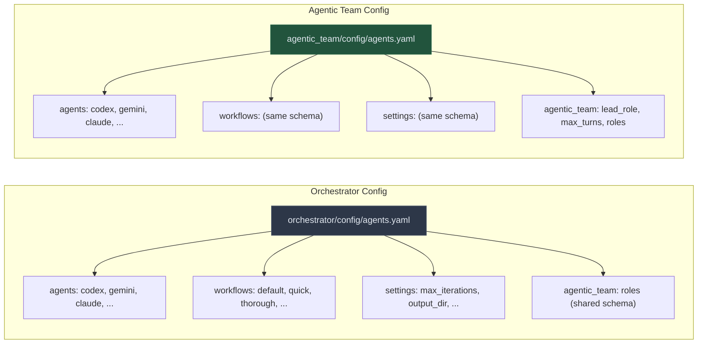

### Available Workflows

| Workflow | Pipeline | Use Case |
|---|---|---|
| `default` | Codex --> Gemini --> Claude | Production-quality code with full review |
| `quick` | Codex only | Fast prototyping |
| `thorough` | Codex --> Copilot --> Gemini --> Claude --> Gemini | Mission-critical code |
| `review-only` | Gemini --> Claude | Analyzing existing code |
| `document` | Claude --> Gemini | Documentation generation |
| `offline-default` | local-code --> local-instruct | Local-only, no cloud dependency |
| `hybrid` | local-code --> Claude (fallback: local-instruct) | Local drafts with cloud review |

## Deployment

### Docker Compose (Recommended)

Both systems are packaged in a single multi-stage Docker image. The `docker-compose.yml` runs each as a separate service.

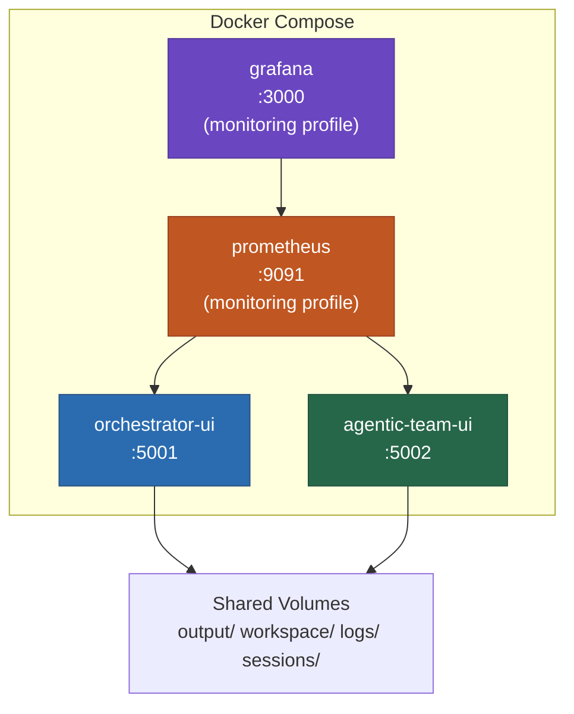

```bash
# Start both UIs
docker compose up --build -d

# Start with monitoring (Prometheus + Grafana)
docker compose --profile monitoring up --build -d

# Stop everything
docker compose down
```

### Kubernetes

```bash
kubectl create namespace ai-coding-tools
kubectl apply -f deployment/kubernetes/
kubectl get pods -n ai-coding-tools
```

See [DEPLOYMENT.md](DEPLOYMENT.md) for systemd, Azure, load balancer, and production hardening guides.

## Testing

The unified test suite (314 tests across 56 modules) covers both systems independently.

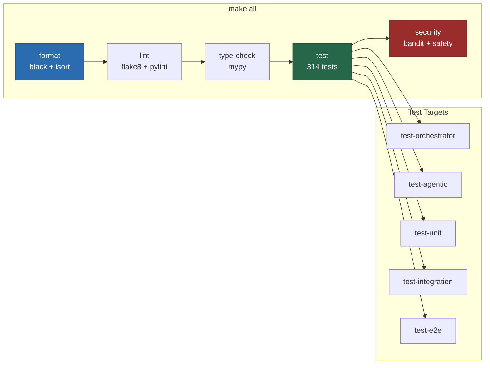

```bash
# Run all tests
make test

# Orchestrator tests only
make test-orchestrator

# Agentic team tests only
make test-agentic

# Unit tests only
make test-unit

# Integration tests only
make test-integration

# Tests with coverage report
make test-coverage
```

### Code Quality

```bash
make lint              # Lint all Python source (flake8 + pylint)
make format            # Format with black + isort
make type-check        # Run mypy on both subsystems
make security          # Run bandit + safety
make all               # Run everything (format, lint, type-check, test, security)
```

## Monitoring

Prometheus metrics are exposed by the orchestrator UI backend on port 9090.

| Metric | Description |
|---|---|
| `orchestrator_tasks_total` | Total tasks executed |
| `orchestrator_task_duration_seconds` | Task execution time |
| `orchestrator_agent_calls_total` | Agent invocations |
| `orchestrator_agent_errors_total` | Agent error count |
| `orchestrator_cache_hits_total` | Cache performance |

Health checks:
- Orchestrator: `http://localhost:5001/health`, `http://localhost:5001/ready`
- Agentic Team: `http://localhost:5002/health`, `http://localhost:5002/ready`

## Documentation

| Document | Description |
|---|---|
| **[SETUP.md](SETUP.md)** | Prerequisites, installation, environment setup, troubleshooting |
| **[ARCHITECTURE.md](ARCHITECTURE.md)** | System architecture and design patterns |
| **[FEATURES.md](FEATURES.md)** | Comprehensive feature documentation |
| **[AGENTIC_TEAM.md](AGENTIC_TEAM.md)** | Agentic team runtime details |
| **[OFFLINE_MODE.md](OFFLINE_MODE.md)** | Offline mode and local model guide |
| **[DEPLOYMENT.md](DEPLOYMENT.md)** | Docker, Kubernetes, systemd, Azure deployment |
| **[ADD_AGENTS.md](ADD_AGENTS.md)** | Guide for adding new AI agents |
| **[orchestrator/README.md](orchestrator/README.md)** | Orchestrator subsystem documentation |
| **[agentic_team/README.md](agentic_team/README.md)** | Agentic team subsystem documentation |
| **[docs/](docs/)** | API references, architecture deep-dives, testing guide, security |

## Screenshots

<p align="center">
  
</p>

<p align="center">
  
</p>

<p align="center">
  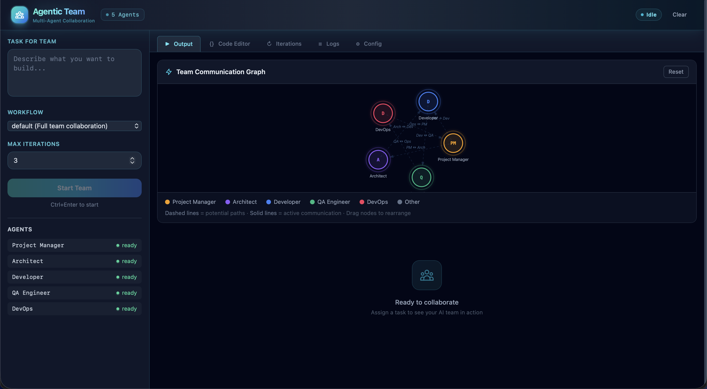
</p>

<p align="center">
  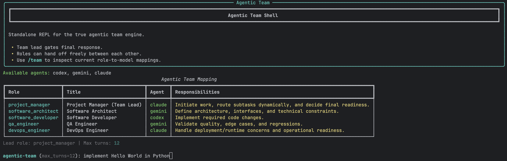
</p>

## MCP Server (Optional -- Model Context Protocol)

Both systems are optionally exposed via a [FastMCP](https://github.com/jlowin/fastmcp) server (`mcp_server/`, port 8000), letting any MCP-compatible client (Claude Desktop, other LLM agents, or custom Python scripts) drive task execution programmatically.

```bash
# Start MCP server (stdio -- for Claude Desktop integration)
python -m mcp_server.server

# Start MCP server (HTTP -- for remote clients)
python -m mcp_server.server --transport http --port 8000
```

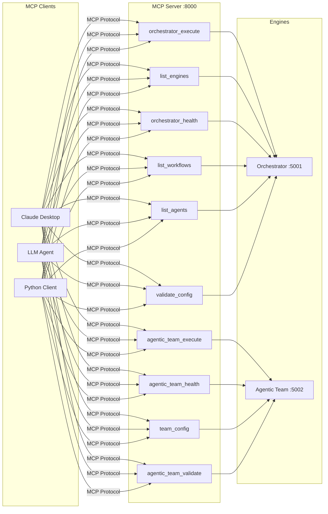

**10 MCP tools** cover task execution, agent listing, workflow listing, team config, health checks, and validation for both systems. See [`mcp_server/server.py`](mcp_server/server.py) for the full tool catalog.

> [!TIP]
> The MCP server is entirely optional. Both the Orchestrator and Agentic Team work fully via their own CLIs and Web UIs without it.

## Contributing

Contributions are welcome. Please see [CONTRIBUTING.md](.github/CONTRIBUTING.md) for guidelines.

1. Fork the repository.
2. Create a feature branch: `git checkout -b feature/your-feature`
3. Make your changes and add tests.
4. Run checks: `make all`
5. Commit using [conventional commits](https://www.conventionalcommits.org/): `git commit -m "feat: add amazing feature"`
6. Push and open a Pull Request.

## Security

For security issues, please email security@example.com. Do not open public issues for security vulnerabilities. See [SECURITY.md](SECURITY.md) for the full security policy.

## License

This project is licensed under the MIT License. See [LICENSE](LICENSE) for details.

## Support

- **Maintainer**: [@hoangsonww](https://github.com/hoangsonww)
- **Issues**: [GitHub Issues](https://github.com/hoangsonww/AI-Agents-Orchestrator/issues)
- **Discussions**: [GitHub Discussions](https://github.com/hoangsonww/AI-Agents-Orchestrator/discussions)

---

<div align="center">

**Made with care by [Son Nguyen](https://github.com/hoangsonww) for the AI development community**

[Back to Top](#ai-coding-tools)

</div>
